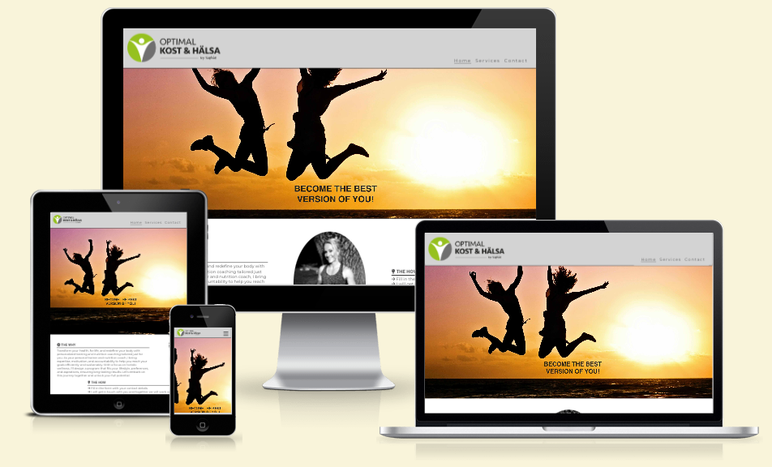

# Optimal Health

The Optimal Health website is a webiste about Personal Training and Nutrition coaching. It targets everyone that is looking for a way to gain better health and quality of life with the tools of Nutrition and Training, no matter the gender or age.

Users of this website will be able to find information about me as a coach, the tools and strategies for Nutrition and Training, how they can benefit from that and what results they can excpect.
There is also a contact form to easily get the first point of contact.
The site is responsive for all screen sizes.

 

## Features
* Navigation Bar
    -   Featured at the top of all three pages, the navigation links are situated to the right. 
    -  On larger screens they show the text; Home, Services and Contact. On smaller screens, such as mobiles, the navigation links are situated in the burger-icon that expands when you click it.

* The Header
    -  At the top left in the header section, there is a company logo, that will take the user to the home page when clicked.   
    -   The Company logo and sets the main color theme; green, gray, black and white.

* The Home page
    -   This is the landing page and with it's colourful and inviting picture of people jumping in the sunset it aspires to bring motivation to the user to take the step towards a healthier lifestyle.
    -   The section below conatins information on WHY the user should take this step and embark on a journey to unlock their full potential.
    -   The section HOW explains how easy it is to get in contact.
    -   There is a picture of me, the Coach, to give a more personalized feeling.
    -   The section the COACH tells more about the certifications and qualifications that the coach possess.

* The Footer

* The Services page
    -   The services page gives the user information on what services are offered
    -   Personal Training. A picture with training equipment, kettlebells, and an informational text on the benefits with personal training and functional fitness.
    -   Nutrition. A picture with food in boxes to give the user a feeling of what will come, since food prepation is a big part of the nutrition coaching. Informational text on the benefits of planning meals and getting knowledge about nutrition in order to make progress with training and getting a healthier lifestyle.
    -   Online Coaching. A picture with the App that will be provided to the users once signing up. Informational text on what to excpect from online coaching and how it is working.
* The Contact page
    -   Background picture of a woman training with ropes that flow towards the user. Also giving the user a feeling of connection through the ropes.
    -   Contact form that allows the user to fill in the necessary contact details to easy get in touch. They are also asked to choose the product of interest; Personal Training, Nutrition or Both.
    -   Submit button says 3..2..1..Go! Which is a common saying in Functional Fitness and CrossFit when starting a workout.

    

## Testing
List

### Unfixed bugs?

## Deployment
-   The site was deployed to Github pages
-   The live link: [Optimal Health] (https://sophietiger.github.io/optimal_health/)

## Credits
### Content
### Media

